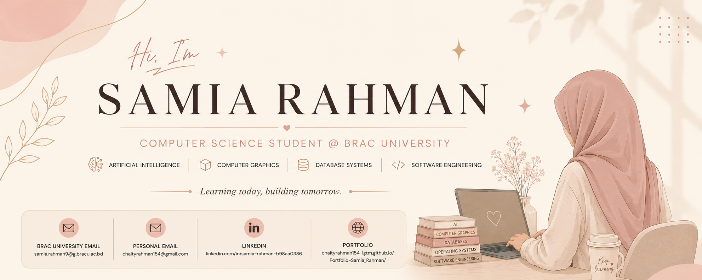

<p align="center">
  
</p>
<div align="center">


<br>

<a href="https://www.linkedin.com/in/samia-rahman-b98aa0386/">

</a>

<a href="mailto:samia.rahman9@g.bracu.ac.bd">

</a>

<a href="mailto:chaityrahman154@gmail.com">

</a>

<a href="https://chaityrahman154-lgtm.github.io/Portfolio-Samia_Rahman/">

</a>

</div>

---

## About Me

Computer Science student at **BRAC University** with interests in:

- Artificial Intelligence
- Computer Graphics
- Database Systems
- Software Engineering
- Problem Solving

I enjoy building projects, learning new technologies, and exploring how software can solve real-world problems.

---

## Current Focus

```text
Artificial Intelligence
Computer Graphics
Database Systems
Operating Systems
Software Engineering
```

---

## Tech Stack

<div align="center">

### Languages


<br><br>

### Web Development


<br><br>

### Tools


</div>

---

## Academic Projects

| Project | Description |
|----------|-------------|
| AI Model Evaluation | Machine learning model evaluation and performance analysis |
| Computer Graphics Games | Interactive 2D and 3D animation projects |
| Metadata Journaling | Operating Systems project focused on filesystem consistency |
| DBMS Project | Relational database design and SQL implementation |
| CSS Playground | Frontend styling experiments and responsive layouts |

---

## GitHub Analytics

<div align="center">


</div>

<br>

<div align="center">


</div>

---

## Connect With Me

📧 **BRAC University Email**  
samia.rahman9@g.bracu.ac.bd

📧 **Personal Email**  
chaityrahman154@gmail.com

💼 **LinkedIn**  
https://www.linkedin.com/in/samia-rahman-b98aa0386/

🌐 **Portfolio**  
https://chaityrahman154-lgtm.github.io/Portfolio-Samia_Rahman/

---

## Quote

> *Learning today, building tomorrow.*

---

<div align="center">


</div>
